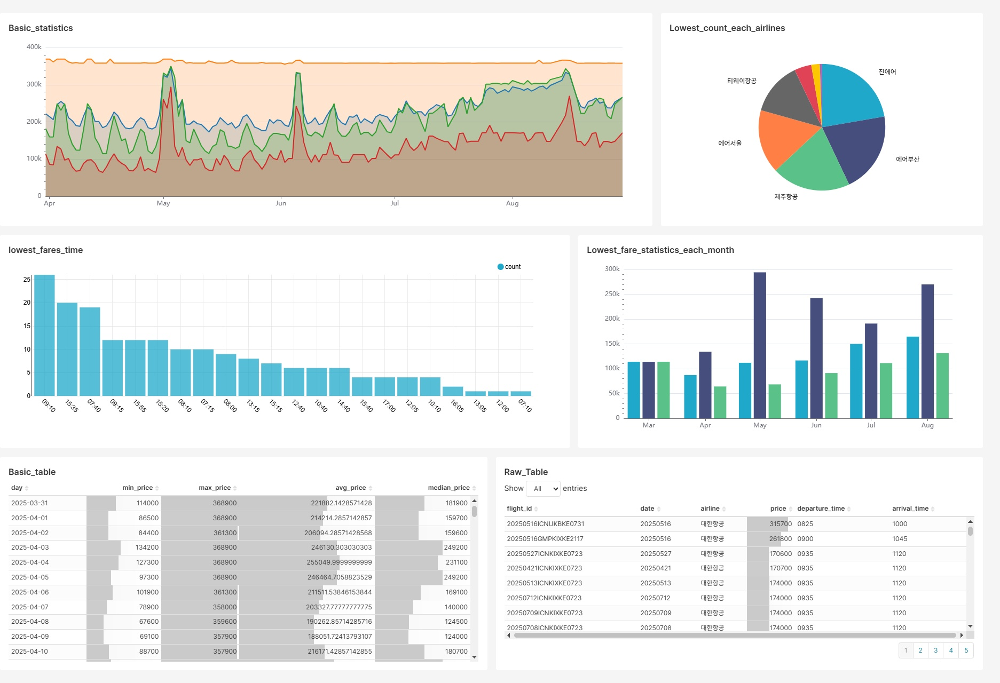

# TicketChecker
## 네이버 항공권 기반 항공권 최저가 모니터링 프로젝트
Naver Flight API를 크롤링하여 그 데이터를 바탕으로 인천 - 나리타 공항 간 항공권 최저가를 시기별로 확인할 수 있도록 대시보드를 구성하는 프로젝트이다.

[대시보드 링크](https://bit.ly/supersets1)

## 구성
DAG 구성은 아래와 같이 이루어진다.
### naver_flight_dag
#### gcs_task
GCP의 서비스키는 프로젝트 단위로 공유를 한다.
이 방식을 기반으로 Airflow Web UI에서는 서비스 키를 설정해높고 공유하여 사용할 수 있으므로, 그를 이용하여 GCS, Bigquery에 정상적으로 연결이 되는지 확인을 진행하는 Task이다.

#### crawl_and_upload_task
Naver Flight API를 통해 10일부터 5개월 이후까지의 데이터를 조회, raw data를 GCS에 저장하도록 하는 Task이다.

이전에 체크한 GCS를 이용해 적절하게 튜닝한 기간에 맞춰 최대한 많은 raw data를 확보하는 것이 목적이며, 140여일 중 최대 100일 정도의 정상적인 데이터를 확보할 수 있다.

#### fetch_transform_task
GCS의 raw data를 가공한 뒤, Airflow의 Task 간 데이터를 공유할 수 있는 xcom에 가공한 날짜별 최저가 데이터를 저장하는 Task이다.

Task 내에서는 json 형태로 저장한 raw data를 가져와 이 json의 key와 각 value를 정확히 확인하여 각 날짜별 최저가를 확인 후 Bigquery에 업로드 가능한 NDJson 형태로 가공하여 xcom에 저장을 진행한다.

#### upload_task
이전 Task에서 xcom에 저장한 가공된 데이터를 Bigquery에 올리는 Task이다.

기존 테이블이 없는 경우 새로 테이블을 만들어 업로드하도록 하였으며, 테이블이 있는 경우 임시 테이블을 만든 뒤 merge하여 이전 데이터를 새 데이터로 덮어씌워 Bigquery 내의 데이터를 항상 최신화한다.

#### DAG 구성
전체적인 DAG의 구성은 아래 이미지와 같이 이루어진다.

### cleanup_airflow_db
db cleanup을 주기적으로 실행해 VM 상 메타데이터를 정리하기 위한 DAG이다.  
단일 DAG로 이루어져 있으며, 주에 1회 DAG를 실행해 메타데이터를 정리해 스토리지를 확보한다.

## 배포

위의 이미지처럼 단순히 VM 상에서 docker compose를 활용해 배포를 진행하였다.

외부 IP를 사용하여 Airflow Web UI에 접속을 시도할 수 있고 이를 통해 Airflow DAG의 정상적인 작동 및 모니터링이 가능하다.

최초에는 k8s를 통해 배포를 진행하려 했으나 [이 링크](https://velog.io/@toho09/TicketChecker-2.-%EB%B0%B0%ED%8F%AC%ED%99%98%EA%B2%BD-%EA%B5%AC%EC%84%B1-%EB%B0%8F-%EA%B5%AC%ED%98%84-%EC%A4%80%EB%B9%84)를 통해 왜 단순하게 배포를 진행했는지 확인할 수 있다.
